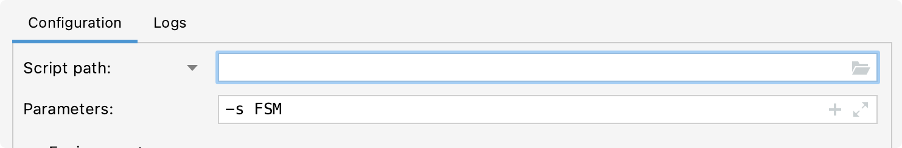

# LING575-Homework2

This is an FST implementation for Homework 2, Questions 1 and 2.
To run, the configuration must pass in the parameter "-s FSM"


**main.py** is the entry point for the program.

Requirements: each response must include a keyword for the intent
- Pizza: "I want a vegan pizza"
- Topping: "I want a mushroom topping"
  -Note: only one topping is currently supported per pizza. 
  That is, only one topping pizzas are available to order.
- Size: "I want a small size"

Ordered items must be spelled the same as in the menu.

Example interaction where a user fully orders a pizza:
```markdown
Welcome to the HW2 Dialog System
> Hello
Welcome to the pizza ordering system. What pizza would you like?
> Pepperoni pizza
What toppings would you like?
> Mushroom topping
The system cannot recognize your input, your option is not in the menu.
> mushrooms topping
What size would you like?
> regular size
The system cannot recognize your input, your option is not in the menu.
> medium size
What crust would you like?
> deep dish crust
What sides would you like?
> caesar salad side
What drinks would you like?
> root beer
The system cannot recognize your input, your option is not in the menu.
> root beet drink
The system cannot recognize your input, your option is not in the menu.
> root beer drink
Do you want delivery service or pick-up?
> pick-up
What's your name?
> Jane Smith
The system cannot recognize your input, your option is not in the menu.
> Jane Smith name
What's your phone number?
> 555-123-6789
I have an order for a medium pepperoni pizza on deep dish crust with mushrooms toppings, caesar salad side, root beer drink for pick-up.
> 
```

Example interaction where a user starts over then cancels their order
```markdown
Welcome to the HW2 Dialog System
> Hello
Welcome to the pizza ordering system. What pizza would you like?
> Vegan pizza
What toppings would you like?
> start-over
Welcome to the pizza ordering system. What pizza would you like?
> pepperoni pizza
What toppings would you like?
> red onions topping
What size would you like?
> cancel
The order is canceled.
```

Example interaction where the user asks the system to repeat itself:
```markdown
Welcome to the HW2 Dialog System
> Hello
Welcome to the pizza ordering system. What pizza would you like?
> Pepperoni pizza
What toppings would you like?
> repeat
What toppings would you like?
> pineapple topping
What size would you like?
> repeat
What size would you like?
> 
```